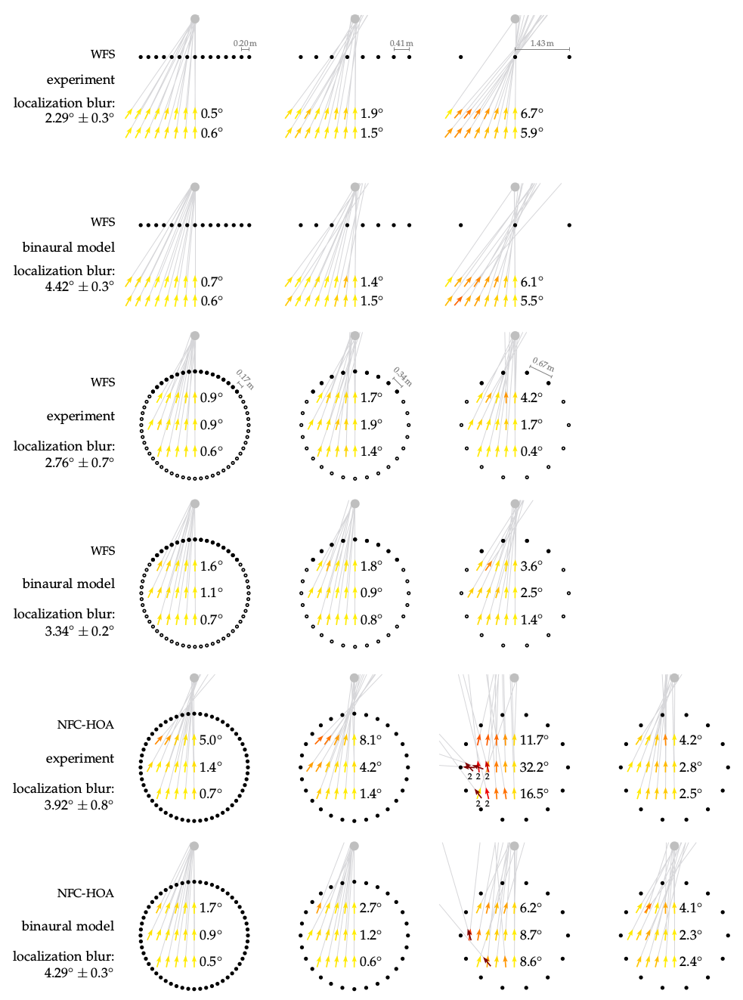
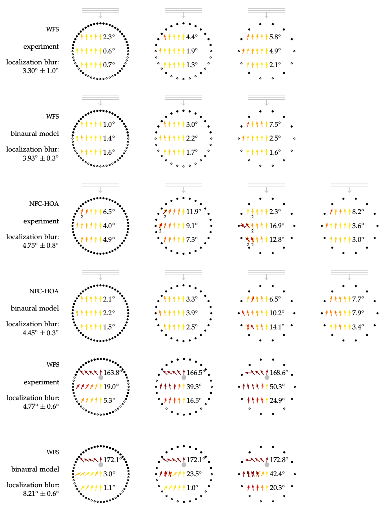

**Figure 6.3a+b**: Average localization
results for all four experiments. The
black symbols indicate loudspeakers,
the grey ones the synthesized source.
On every listening position an arrow
is pointing into the direction the
listener perceived the corresponding
auditory event from. The color of the
arrow displays the absolute localization
error, which is also summarized
beside the arrows for every row of
positions. The average confidence interval
for the localization results is 2.3°.
Listening conditions that resulted in
listeners saying that they perceived two
sources in Exp. 4 of Section 5.1 are
highlighted with a small 2 written below the
position.

## Steps for reproduction

Bash:
```Bash
$ gnuplot sfs_localization_model.gnu
```

If you want to recalculate the model results you have to run the following in Matlab/Octave:
```Matlab
>> cd data_wfs_linear/
>> results_wfs_ps_linear
>> cd ../data_wfs_circular/
>> results_wfs_ps
>> results_wfs_pw
>> results_wfs_fs
>> cd ../data_hoa_circular/
>> results_hoa_ps
>> results_hoa_pw
```
This will override the txt result files in the main directory. The calculation
might take several hours.


