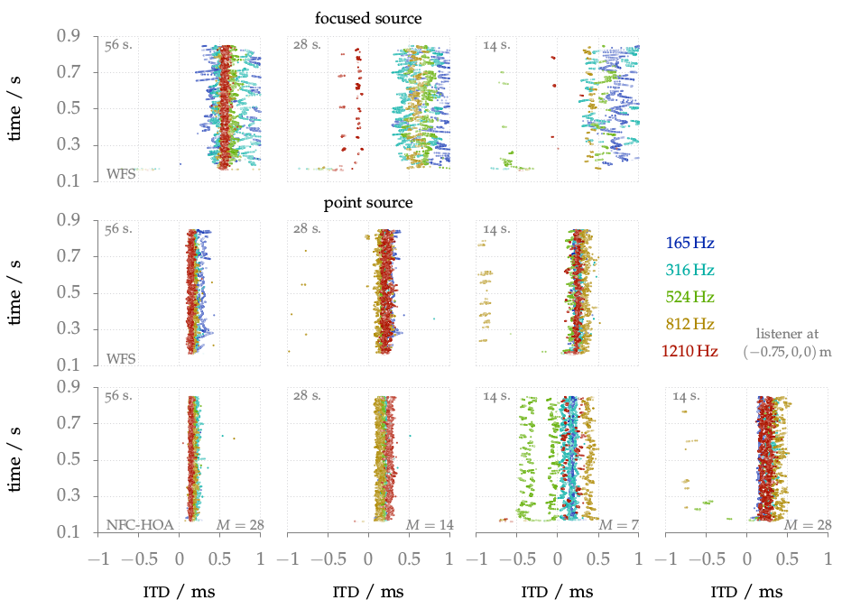

**Figure 6.4**: ITD values over time for
different frequencies as indicated by
the color. The ITD was calculated by
the binaural model for a single noise
burst synthesized as a focused source or
point source with WFS (2.76), (2.64) and
NFC-HOA (2.50). The magnitude of the
signal in the frequency channel is
indicated by the opacity of the ITD points,
with lighter points correspond to lower
magnitudes.

## Steps for reproduction

Matlab/Octave:
```Matlab
>> itd_frequency_channels
```

Bash:
```Bash
$ gnuplot itd_frequency_channels.gnu
```
