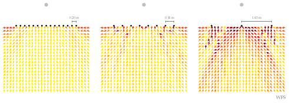

**Figure 6.5**: Model predictions of the perceived directions for a synthesized
point source in the audience area.  The three different linear secondary source
distributions were all driven by WFS (2.64).

## Steps for reproduction

Bash:
```Bash
$ gnuplot fig6_05.plt
```

If you want to recalculate the model results you have to run the following in
Matlab/Octave:
```Matlab
>> fig6_05
```
This will override the txt result files in the `data` directory. The calculation
might take several hours.

The directory `source_vs_loudspeaker/` includes a Matlab/Octave script to
estimate the amount localization towards the direction of single loudspeaker
(this is discussed in Section 6.4.2 in the thesis). In order to re-estimate
the values you can run the following in Matlab/Octave:
```Matlab
>> cd source_vs_loudspeaker/
>> source_vs_loudspeaker
```
This will override the file `source_vs_loudspeaker/wfs_localization_error.txt`
and print out results on the screen.
