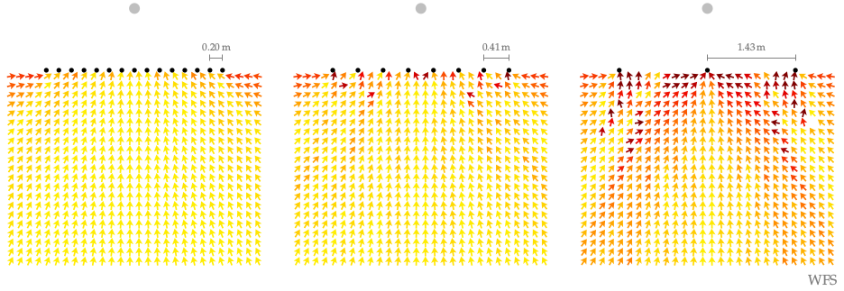

**Figure 6.5**: Model predictions of the
perceived directions for a synthesized
point source in the audience area.
The three different linear secondary
source distributions were all driven by
WFS (2.64).

## Steps for reproduction

Bash:
```Bash
$ gnuplot wfs_linear_model.eps
```

If you want to recalculate the model results you have to run the following in Matlab/Octave:
```Matlab
>> wfs_linear_model
```
This will override the txt result files in the main directory. The calculation
might take several hours.

The directory `source_vs_loudspeaker/` includes a Matlab/Octave script to
estimate the amount of single loudspeaker localization out of the loudspeaker
array (this is discussed in Section 6.4.2 in the thesis). In order to reestimate
the values you can run the following in Matlab/Octave:
```Matlab
>> cd source_vs_loudspeaker/
>> source_vs_loudspeaker
```
This will override the file `wfs_localization_error.txt` and print out results
on the screen.
