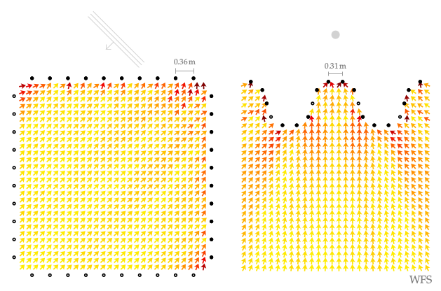

**Figure 6.6**: Model predictions of the perceived direction for a synthesized
sources in the audience area. Both secondary source distributions were driven by
WFS with (2.57) for the plane wave and (2.64) for the point source.

## Steps for reproduction

Matlab/Octave:
```Matlab
>> fig6_06
```

Bash:
```Bash
$ gnuplot fig6_06.plt
```

Note, that the figure was afterwards slightly modified by removing the
predictions for parts behind the concave loudspeaker array and by rotating the
plane wave symbol by -45 deg and making it slightly smaller.
