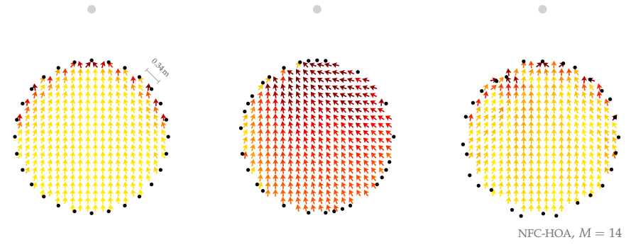

**Figure 6.7**: Model predictions of the perceived direction for a synthesized
point source in the audience area. All three secondary source distributions were
driven by NFC-HOA (2.50) with an order of 14. For both distributions to the
right the positions of the secondary sources were changed.

## Steps for reproduction

Matlab/Octave:
```Matlab
>> fig6_07
```
The above command will most probably not reproduce the middle graph of the
figure. This is due to the random process of jittering of the loudspeaker angle
will also rearrange the loudspeaker in a way that the output channels of the
driving functions do not correspond with the actual order of secondary sources.
The only way around is to arrange the secondary sources yourself. This means you
have to adapt lines 66-68 in `fig6_07.m`.

Bash:
```Bash
$ gnuplot fig6_07.plt
```

Note, that the arrows outside of the loudspeaker array have been removed in
Inkscape after running gnuplot.
