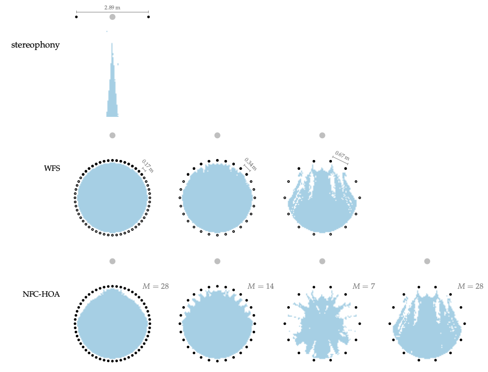

**Figure 6.8**: Model prediction of the sweet-spot sizes for different SFS
setups synthesizing a point source. As a comparison a stereophony setup presents
the same source. The sweet-spot is defined as all points where the absolute
localization error is less or equal to 5°.

## Steps for reproduction

Matlab/Octave:
```Matlab
>> fig6_08
```
The above command will run for several hours/days, depending on your PC.

Bash:
```Bash
$ gnuplot fig6_08.plt
```
