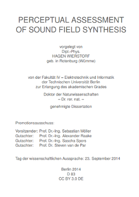

Perceptual Assessment of Sound Field Synthesis
==============================================

This repository provides you the following PhD thesis, together with Errata and
all the software you need to reproduce all figures presented in the thesis.

[Hagen Wierstorf - Perceptual Assessment of Sound Field
Synthesis](http://opus4.kobv.de/opus4-tuberlin/files/6063/wierstorf_hagen.pdf)

[](http://opus4.kobv.de/opus4-tuberlin/files/6063/wierstorf_hagen.pdf)

The software is spread in different directories named after the chapter and
figure numbers. In order to run the code you will need the external toolboxes
mentioned below and Matlab or Octave. Some of the code runs only in Octave at
the moment, but it should be easily adoptable to Matlab. A README in the
corresponding directory is indicating those cases.

## Errata

The WFS driving functions for a focused source (2.71) and (2.72) have the
direction in time. The exponential function at their ends should read
```
e^{i\frac{omega}{c}|x_0-x_\text{s}|}
```

## Software Requirements

### Sound Field Synthesis Toolbox

From the [Sound Field Synthesis Toolbox](https://github.com/sfstoolbox/sfs) git
repository you need to checkout the version *commit 3730bc0*, which is identical
with release 1.0.0. Under Linux this can be done the following way:
```
$ git clone https://github.com/sfstoolbox/sfs.git
$ cd sfs
$ git checkout 3730bc0
```


### Auditory Modelling Toolbox

From the [Auditory Modelling Toolbox](http://amtoolbox.sourceforge.net/) git
repository you need to checkout the version *commit aed0198*. Under Linux this
can be done the following way:
```
$ git clone https://github.com/hagenw/amtoolbox.git
$ cd amtoolbox
$ git checkout aed0198
```

The [Auditory Modelling Toolbox](http://amtoolbox.sourceforge.net/) depends
further on the [Large Time-Frequency Analysis
Toolbox](https://github.com/hagenw/ltfat.git), which you can get in the same
way:
```
$ git clone https://github.com/hagenw/ltfat.git
$ cd ltfat
$ git checkout 3f9af4a
```

### Setting up Toolboxes in Matlab

After installing both toolboxes you have to start them first in Matlab/Octave in
oder to run the scripts provided with this PhD thesis.
This can be done by running the following commands from the `sfs/` and
`amtoolbox/` directory, respectively.
```Matlab
>> cd sfs
>> SFS_start;
>> cd ../ltfat
>> ltfatstart;
>> cd ../amtoolbox
>> amtstart;
```

Now everything is prepared and you can start to reproduce any figure in the
thesis.

The scripts presented here were tested with Matlab 8.1.0.604 (R2013a), Octave
3.8.2, gnuplot 4.6 patchlevel 6.


## License

Copyright 2015 Hagen Wierstorf

Licensed under the Apache License, Version 2.0 (the "License");
you may not use this file except in compliance with the License.
You may obtain a copy of the License at

http://www.apache.org/licenses/LICENSE-2.0

Unless required by applicable law or agreed to in writing, software
distributed under the License is distributed on an "AS IS" BASIS,
WITHOUT WARRANTIES OR CONDITIONS OF ANY KIND, either express or implied.
See the License for the specific language governing permissions and
limitations under the License.
